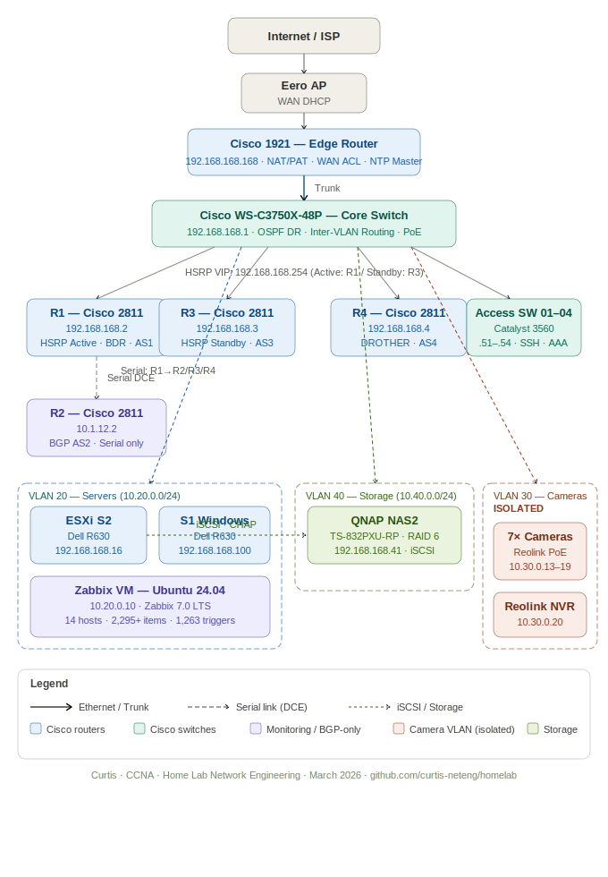

# Curtis Laffin — Home Lab

**CCNA Certified | Network Engineering | March 2026**

A production-grade enterprise home lab built to support a career transition from law enforcement into network engineering. Every project is designed to generate real, demonstrable skills — not just checkbox certifications.

---

## Lab Overview

| Category | Details |
|---|---|
| **Certifications** | CCNA (active) — CCNP Enterprise in progress |
| **Focus Areas** | Routing & Switching, Network Security, Monitoring, Virtualization, Automation |
| **Current Role** | Security Analyst Intern — Zen Cybersecurity |
| **Background** | 16 years law enforcement — discipline, documentation, security clearance eligible |

---

## Network Topology



---

## Hardware Inventory

### Network Infrastructure

| Device | Model | Role | Status |
|---|---|---|---|
| Edge Router | Cisco 1921/K9 | WAN edge, NAT, NTP master | ✅ Active |
| Core Switch | Cisco WS-C3750X-48P | Layer 3 core, inter-VLAN routing, PoE | ✅ Active |
| Distribution Routers | Cisco 2811 ×4 (R1–R4) | OSPF, EIGRP, BGP, HSRP | ✅ Active |
| Access Switches | Cisco Catalyst 3560 ×4 (SW1–SW4) | Access layer, 1G GLC-T SFP uplinks | ✅ Active |
| Firewall | Cisco ASA 5516-X | Perimeter security | 🔧 On Hold |

### Servers

| Device | Model | OS / Role | IP |
|---|---|---|---|
| S1 | Dell PowerEdge R630 | Windows Server 2019, Tailscale, DuckDNS | 192.168.168.100 |
| S2 | Dell PowerEdge R630 | VMware ESXi 6.7 — primary VM host | 192.168.168.16 |
| S3 | Dell PowerEdge R630 | Linux / Ansible (coming soon) | Pending |

### Storage & Monitoring

| Device | Model | Role | IP |
|---|---|---|---|
| NAS1 | QNAP TS-453BU | Storage | 192.168.168.40 |
| NAS2 | QNAP TS-832PXU-RP | RAID 6 — iSCSI datastore for ESXi | 192.168.168.41 |
| UPS | CyberPower CP1500PFCLCD | Power protection — USB to S1 | — |

---

## VLAN Design

| VLAN | Name | Subnet | Purpose |
|---|---|---|---|
| 168 | Management | 192.168.168.0/24 | All device management traffic |
| 20 | Servers | 10.20.0.0/24 | VM workloads, Zabbix monitoring |
| 30 | Cameras | 10.30.0.0/24 | **Isolated** — cameras and NVR only, no internet |
| 40 | Storage | 10.40.0.0/24 | iSCSI and NAS storage traffic |

---

## Routing Protocols

| Protocol | Scope | Details |
|---|---|---|
| **OSPF Area 0** | Core switch + all routers | Core switch is DR (router-ID 168.168.168.1), R1 is BDR |
| **EIGRP AS 90** | All 4 routers | R1 is hub, ethernet paths preferred, R3/R4 load balance |
| **eBGP** | R1–R4 | Multi-AS: AS 1/2/3/4 — all sessions established |
| **HSRP** | R1 (Active) + R3 (Standby) | VIP 192.168.168.254 — sub-10s failover tested and verified |

---

## Virtual Machines

| VM | OS | IP | Purpose |
|---|---|---|---|
| zabbix-monitor | Ubuntu 24.04 LTS | 10.20.0.10 | Zabbix 7.0, Docker, Plate Recognizer LPR |
| unifi-controller | Ubuntu 24.04 LTS | 192.168.168.56 | UniFi Network Controller |

---

## Key Projects

### 🔒 Camera Network Isolation (VLAN 30)
- 7 Reolink PoE cameras + NVR + doorbell isolated on dedicated VLAN
- ACL-enforced inter-VLAN policy — cameras have no internet access
- DHCP reservations for NVR (`10.30.0.20`) and doorbell (`10.30.0.21`)
- Reolink app + NVR handle recording and live view

### 📷 License Plate Recognition (LPR)
- Plate Recognizer Stream v1.61.0 deployed in Docker on Zabbix VM
- Integrated with Reolink RLC-823A via RTSP (`10.30.0.14`)
- Real Wisconsin plates captured with vehicle images and timestamps
- `min_dscore=0.70` filter eliminates bumper badge false reads
- Dashboard: `http://10.20.0.10:8001`

### 📊 Zabbix Monitoring (16 Hosts)
- Zabbix 7.0 LTS — SNMP polling all Cisco devices, ESXi, QNAP NAS, Windows Server, UniFi controller
- All 16 hosts green — 2,300+ monitored items
- Zabbix Agent 2 on Windows Server S1
- See [`docs/zabbix-monitoring-setup.md`](docs/zabbix-monitoring-setup.md)

### 🔗 Access Switch SFP Upgrade (March 2026)
- Installed Cisco GLC-T (1000BaseTX) SFP modules on all 4 Catalyst 3560s
- All access switch uplinks upgraded from 100Mbps to 1G
- SW3 required native VLAN mismatch fix (VLAN 1 → VLAN 168) and `no shutdown` on Gi0/1

### 🌐 Remote Access
- **Tailscale** — S1 as subnet router, advertising `192.168.168.0/24`
- **DuckDNS** — `curtishomelab.duckdns.org` auto-updates every 5 minutes
- Full remote access to all lab resources from anywhere

### 🛡️ WAN Security
- Inbound ACL blocking spoofed RFC 1918 traffic — 36,000+ packets blocked in first days
- PAT overload for all internal VLANs
- Static NAT entries for RDP (S1) and NVR external access

---

## Troubleshooting Log

Real incidents documented with symptom, root cause, and resolution — written as interview material.

[📄 View Full Troubleshooting Log](docs/troubleshooting-incident-log.md)

| # | Incident | Category |
|---|---|---|
| 01 | ACL Lockout — Core Switch | Security / Access |
| 02 | DHCP MAC Binding Failure — NVR | DHCP / Switching |
| 03 | Camera VLAN No Internet (3 simultaneous issues) | Routing / NAT / VLANs |
| 04 | WAN ACL — RFC 1918 Spoofed Traffic | Security / WAN |
| 05 | OSPF No Adjacency — R1 to Core Switch | Routing / OSPF |
| 06 | HSRP Failover — SSH Lost During Test | HSRP / Access |
| 07 | iSCSI No Space for LUN | Storage |
| 08 | BGP Stale Neighbor — AS 16 | Routing / BGP |
| 09 | Zabbix ICMP Ping Failure — All Routers | Monitoring / Routing |
| 10 | SW3 Native VLAN Mismatch | Switching |
| 11 | Plate Recognizer — Bumper Badge False Reads | LPR / Docker |

---

## Device Configs

Sanitized running configurations for all network devices.

```
configs/
├── core-switch.txt       # Cisco WS-C3750X — VLANs, OSPF, DHCP, PoE, ACLs
├── edge-router.txt       # Cisco 1921 — NAT, WAN ACL, NTP, OSPF
├── r1.txt                # OSPF, EIGRP, BGP AS1, HSRP Active
├── r2.txt                # BGP AS2
├── r3.txt                # OSPF, EIGRP, BGP AS3, HSRP Standby
├── r4.txt                # OSPF, EIGRP, BGP AS4
├── access-sw-01.txt      # Catalyst 3560, GLC-T SFP, 1G uplink
├── access-sw-02.txt
├── access-sw-03.txt      # Native VLAN mismatch fix applied
└── access-sw-04.txt
```

---

## Documentation

| Document | Description |
|---|---|
| [Addressing Reference](docs/addressing-reference.md) | Full IP/VLAN/port map for all devices |
| [Zabbix Monitoring Setup](docs/zabbix-monitoring-setup.md) | Install guide + host configuration |
| [Troubleshooting Log](docs/troubleshooting-incident-log.md) | 11 real incidents with root cause analysis |

---

## What's Next

- **S3 / Ansible** — SSD arriving April 2026, Linux install, network automation
- **Active Directory** — DNS/DHCP roles on Windows Server S1
- **UniFi U6+ AP** — WiFi integration, hidden VLAN 30 SSID for cameras
- **ASA 5516-X** — Firewall integration (pending licensing)
- **Site-to-site VPN**
- **Syslog server**
- **ntopng + SPAN port traffic analysis**

---

*Curtis Laffin | CCNA | github.com/curtis-neteng/homelab*
